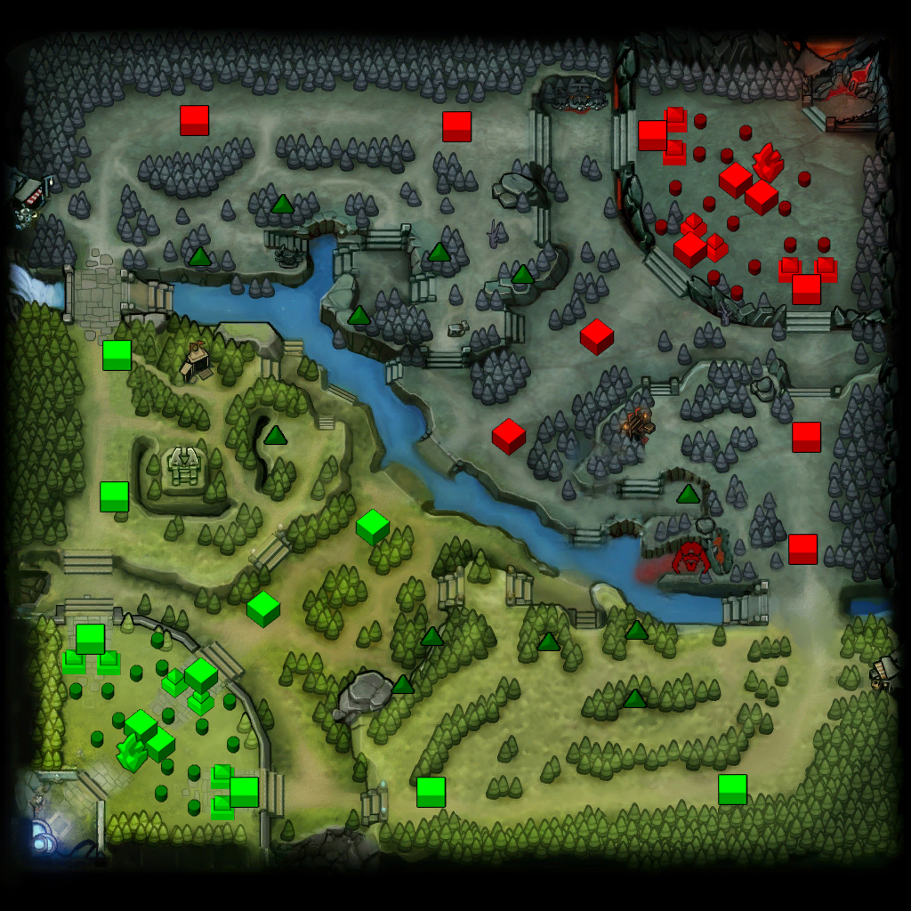

```{r setup, include=FALSE}
knitr::opts_chunk$set(echo = TRUE)
library(knitr)
library(dplyr)
library(tidyr)
library(ggplot2)
library(caTools)

CombinedDF <- read.csv("CombinedDF.csv")

# This RPubs document publishes to here:
# http://rpubs.com/LMS/Capstone_Dota2_Report
```

## **Introduction**
The aim of this report is to provide new players to Dota 2 some starting strategies that will help them progress and win matches. The analysis used a Dota 2 dataset of 50,000 matches with data collected on all 10 players per match, leading to 500,000 separate observations. It has identified important variables that influence the amount of gold a player finishes with and has made some key observations with regards to winning matches.

### **What is Dota 2?**
Dota 2 (Defence Of The Ancients 2) is a popular free-to-play multiplayer online battle arena (MOBA) that consists of two teams of five players against each other who fight for two sides; the Radiant and the Dire.  The objective of the game is for each team to gain access to the enemy base and destroy their large structure called an ‘Ancient’.  Each base is linked by three paths commonly referred to as ‘top, middle or lower lanes’.  Each lane has three towers and two barracks.  The towers act as defensive structures that automatically attack enemy units and the barracks act as spawn locations for AI-controlled units called ‘creeps’ that go out in waves along their corresponding lanes.  These will also automatically attack enemy units and structures they encounter in their lanes. The general objective for players is to escort their creep towards the enemy base, help them destroy enemy defence towers, gain access to their base and destroy the enemy 'Ancient' structure.

```{r, out.width="400px",fig.align="center", echo=FALSE}

```

<center>Dota 2 mini map at start of the game where cubes (11/side) represent tower positions for Radiant (green) and Dire (red), smaller double-cubes (6/side)represent barracks location and non-cube (1/side) represents ‘Ancient’ location</center>


### **The Dataset**
Kaggle user Devin posted an excellent dataset of Dota 2 matches to [https://www.kaggle.com/devinanzelmo/dota-2-matches]. Here data was collected on a wide range of different variables from which heroes are picked, to the kills, deaths and assists they accrue to gold and xp accumulation for each match. This project focused on two main files; match.csv and players.csv. The file Hero_Names.csv was modified and used to support the work conducted on the match and players files.

The key variables within match.csv and players.csv used for this project are listed below. These two files were linked by the variable 'hero_id' into the data frame 'CombinedDF' and exported to 'CombinedDF.csv'.

#### **match.csv**
```{r Match Overview, echo=FALSE}
# make a data frame of all variables in 'match' combined with their descriptions

Variable <- as.character(c("match_id", "start_time", "duration", "tower_status_radiant", "tower_status_dire", "barracks_status_dire", "barracks_status_radiant", "first_blood_time", "game_mode", "radiant_win"))

Description <- as.character(c("unique integer to identify matches across all files", "match start time in seconds since 00:00, 01/01/1970, UTC", "length of match in seconds", "total health of all Radiant towers at match end", "total health of all Dire towers at match end", "total health of all Dire barracks at match end", "total health of all Radiant barracks at match end", "timestamp in seconds of when first player is killed from match start", "an integer indicating which game mode the match is playing", "a factor indicating if the radiant team won or lost the match"))

Match_Overview <- dplyr::data_frame(Variable, Description)
knitr::kable(Match_Overview, format = "markdown")
``` 

#### **players.csv**
```{r Players Overview, echo=FALSE}
# make a data frame of all variables in 'players' combined with their descriptions

Variables <- as.character(c("match_id", "account_id", "hero_id", "player_slot", "gold", "gold_spent", "gold_per_min", "xp_per_min", "kills", "deaths", "assists", "denies", "last_hit", "hero_damage", "tower_damage", "level", "leaver_status", "unit_order_total"))

Descriptions <- as.character(c("unique integer to identify matches across all files", "unique integer to identify players. 0 (zero) represent anonymous players", "unique integer to identify which hero was selected per player", "unique integer where 0-4 represent players on Radiant side and 128-132 the Dire side", "amount of gold player has at match end", "amount of gold player spent during the match", "amount of gold per minute a player accumulated on average during the match", "amount of experience points per minute a player accumulated on average during the match", "total kills a player scored per match", "number of times a player died per match", "number of assists a player gained per match", "number of denies a player performed per match", "number of last hits a player landed on creep per match", "cumulative amount of damage a player caused to enemy heroes", "cumulative amount of damage a player caused to enemy towers", "the hero character level a player obtained by match end", "integer indicating if a player stayed until match end or left early", "the total number of commands a player conducted in a match with keyboard and mouse"))

Players_Overview <- dplyr::data_frame(Variables, Descriptions)
knitr::kable(Players_Overview, format = "markdown")
```

## **Data Wrangling**
While initially examining CombinedDF data frame it quickly became clear that some of these matches were not played at a competitive level. It is expected that these matches would collect spurious data and were removed. For example while looking at the histogram of the variable 'duration' it was seen that the longest match recorded went on for over 4 hours. Research online on Dota 2 forums suggested that typically matches would last between 20-60 minutes each. 

The dataset was narrowed down to matches that last between 15-75 minutes to reduce the number of non-competitive matches in the analysis. This filter also managed to remove most matches that would have been filtered by other means. In the variable 'hero_id' where the value was 0 indicated that no hero was selected. This was due to teams being unbalanced in numbers and not a true 5v5 match from the start. Most of the matches with 'hero_id' 0 present had already been removed by the 15-75 minute filter of 'duration'. This was also true for matches where 'leaver_status' was not equal to 0. A 'leaver_status' of 1-4 indicated that at some point someone left the match, again creating imbalance in those matches.  Most of these had also been removed by the 'duration' filter.

Finally the file 'hero_names.csv' was modified by adding each hero's class and their roles they are associated with, and then added to the final 'CombinedDF' file. This file was the working dataset going forward with 420,510 separate observations across 51 different variables.

## **Models and Conclusions**
The hero Windranger, the hero selected most often in the dataset, was used to identify the most important variables that impact 'gold' with multi-linear regression modelling. Windranger was also used to infer which variables are most important to winning matches with logistic regression modelling.

### **Modelling gold with linear regression**
A key component in Dota 2 is gold which allows players to buy and upgrade equipment to make them perform better in a match. Gold was compared to several other variables in several multiple linear regression models to identify how influential each independent variable was upon the dependent gold variable.  The most important variables are summarised in the table below.

```{r independent variables influential to gold, echo=FALSE}
Influential.Variables <- as.character(c("duration", "gold_per_min", "Win", "gold_spent", "deaths", "xp_per_min", "hero_damage"))
Impact <- as.character(c("The length of matches will significantly impact the amount of gold a hero will finish with", "the rate of gold a hero gathers through the match", "Playing for a winning team will most likely produce more gold", "Spending gold will significantly impact how much a hero finishes with", "When a hero dies they lose an amount of gold", "The amount of gold lost upon death is determined by their level. Level is a discrete variable so continuous variable 'xp_per_min' is used to represent level", "Killing and assisting in killing enemy heroes provide gold. The continuous variable 'hero_damage' represents these two discrete variables"))

Gold.Variables <- data.frame(Influential.Variables, Impact)
kable(Gold.Variables, format = "markdown")
```

The best model identified is as follows.


```{r Windranger Linear Model, echo=FALSE}
# Selecting all Windranger data
Windranger <- CombinedDF[which(CombinedDF$Name=="Windranger"),]

Windranger.lm <- lm(gold ~ duration * gold_per_min + Win + gold_spent + deaths * xp_per_min + hero_damage, data=Windranger)
summary(Windranger.lm)
```

The following conclusions for acquiring gold are drawn from this model.

* Winning matches has a very strong positive relationship to the amount of gold a player will finish with. To finish with a lot of gold winning is important.

* Spending gold has a slight negative relationship with the amount of gold a player finishes with. This suggests that spending gold must be done wisely on equipment that will improve the heroes capability to go out and collect gold more efficiently.

* Acquiring experience quickly (xp_per_min) is important to levelling up heroes fast. The higher the level a hero is the more impact they have and the more gold they can accumulate. The faster a hero can level, the more likely it is they will be a higher level than the enemy heroes, increasing their chances of winning fights between them.

* Avoiding deaths in a match is important to keeping gold. Gold is lost every time a hero dies. The amount of gold a hero loses is tied to the level they at the time of a death. Therefore dying later in a match when hero levels are higher has much more impact. Avoid deaths, especially towards the end of matches.


### **Modelling wins by inference with logistic regression**
Several variables were analysed in logistic regression models to infer their importance to winning Dota 2 matches. The following logistic regression model was made and found to be most suitable.

```{r Windranger Logistic Regression Modelling, echo=FALSE}
# Selecting all Windranger data
Windranger <- CombinedDF[which(CombinedDF$Name=="Windranger"),]

# set the seed point
set.seed(1234)

# Split the Windranger data set into Training and Testing sets
SplitWR <- sample.split(Windranger, SplitRatio = 0.5)

TrainWR <- subset(Windranger, SplitWR == TRUE)
TestWR <- subset(Windranger, SplitWR == FALSE)

# build logistic regression model for Windranger using duration, gold_spent, gold_per_min, xp_per_min, deaths, assists, hero_damage and unit_order_total
Windranger.LogM <- glm(Win ~ duration + gold_spent + gold_per_min + xp_per_min + deaths + assists + hero_damage + unit_order_total, data = TrainWR, family = binomial)
summary(Windranger.LogM)

```

In this model it is seen that the variables with the largest regression coefficients to winning are the combat variables.  These are 'assists' which has a positive relationship to winning and 'deaths' which has a negative relationship to winning. 

It was determined in previous models that getting kills in matches did not significantly contribute to winning. Here is the model with 'kills' included.

```{r Windranger Logistic Regression Modelling INCLUDING kills, echo=FALSE}
# Selecting all Windranger data
Windranger <- CombinedDF[which(CombinedDF$Name=="Windranger"),]

# set the seed point
set.seed(1234)

# Split the Windranger data set into Training and Testing sets
SplitWR <- sample.split(Windranger, SplitRatio = 0.5)

TrainWR <- subset(Windranger, SplitWR == TRUE)
TestWR <- subset(Windranger, SplitWR == FALSE)

# build logistic regression model for Windranger using duration, gold_spent, gold_per_min, xp_per_min, deaths, assists, hero_damage and unit_order_total
Windranger.LogM_kills <- glm(Win ~ duration + gold_spent + gold_per_min + xp_per_min + deaths + assists + kills + hero_damage + unit_order_total, data = TrainWR, family = binomial)
summary(Windranger.LogM_kills)

```

In this model it can be seen that kills has a probability of 10.2% of not being significant to winning. This was initially surprising since a core aspect of Dota 2 is combat. However in the original model (Windranger.LogM) it is seen that getting assists is significant and positively impacts winning. This means that for players to increase their chances of winning they should contribute to fighting and help out their teammates in fights with enemy heroes, but should not worry about getting that final killing blow. They should not over-extend themselves just to get a kill as this can expose themselves to unnecessary risks of dying. Avoiding death is very important to being successful in Dota 2, as dying is shown to have a negative impact to winning as shown in the model.

The variable 'duration' shows a positive correlation to winning in the model. This indicates that the longer a match goes on for the more likely Windranger will win.  

This led to further analysis in the form of comparing duration for Windranger against the second most popular hero, Shadow Fiend. Shadow Fiend is a good selection here for comparision since it is a hero that is more designed to focus on combat, where as Windranger can cover more roles and is more of a generalist.

The following compares Windranger's and Shadow Fiend's duration density plot split out by win / loss.

```{r, Windranger duration density plot, out.width="400px",fig.align="center", echo=FALSE}
# Selecting all Windranger data
Windranger <- CombinedDF[which(CombinedDF$Name=="Windranger"),]

# ggplot of Windranger duration split out by win/loss
ggplot(Windranger, aes(x = duration, colour = WL)) +
  geom_density()
```

<center>This density plot shows that Windranger wins more often in longer, drawn-out matches.</center>

```{r, Shadow Fiend duration density plot, out.width="400px",fig.align="center", echo=FALSE}
# Selecting all Windranger data
ShadowFiend <- CombinedDF[which(CombinedDF$Name=="Shadow Fiend"),]

# ggplot of Windranger duration split out by win/loss
ggplot(ShadowFiend, aes(x = duration, colour = WL)) +
  geom_density()
```

<center>This density plot show that Shadow Fiend wins more often in shorter matches.</center>

These two plots show that Windranger wins more of the longer matches and Shadow fiend wins more of the shorter matches, indicating types of styles of how players should play these heroes based on duration alone. Heroes like Shadow Fiend should push for a quick win and Windranger should try to long-out matches and endure pushes against their side so they have more time to rank up and increase their chances of winning. This analysis shows that further work can be done to understand how team compositions should be put together.

### **Future Work**

The data frame 'CombinedDF' has a very large mix of diverse variables that could be used in many ways to explore the game Dota 2. This study has only looked at the Windranger hero in depth, the most selected hero within this dataset. Further work should look at other heroes such as Shadow Fiend, as quite different hero with only two roles which are all about combat and has slightly more wins than losses recorded.

The brief look into Shadow Fiend's duration when compared to Windranger brings in more questions such as what is a good team composition? How should this team play? Do they go for a quick win or should they go for a slow and steady win? One might imagine that a team consisting of only support heroes will struggle to win, as will teams with no support roles. How do different team compositions play out against each other?

The investigation into gold and how gold_spent influences gold raised questions about items. In this study the specific items that were bought throughout each match was excluded. However a detailed examination of this information might identify which items are more effective at improving a heroes chances of winning matches. It may also show that some items work better for different heroes.

In the orgininal dataset there were 33 separate columns dedicated to 'unit_order_' which were simply amalgamated into 'unit_order_total' for this study, however analysis of these individual variables may open interesting views on how to play, or how different heroes are played. This could lead to identifying best ways of playing Dota 2.

Further to this the dataset posted to Kaggle by devin contained many more csv files relating to these matches which could be brought into the study to further enrich future analysis. This study has only scratched the surface of the possible avenues of exploration here. It has been extremely interesting and I highly recommend this dataset for further analysis.

### **References**
Key documents for this report are:
* Dota2_Introduction.Rmd
* Dota2_Data_Wrangling.Rmd
* Dota2_Analysis_Summary.Rmd

Important support documents with raw working are:
* Dota2_Analysis_and_Results.Rmd
* Dota2_Detailed_Analysis.Rmd

